# 2025 全球 20 款最強 AI 工具推薦！最新 Top100 AI 熱門榜

---

AI 技術在 2024 年持續突破，各種新工具层出不穷。从生成文案到制作视频，AI 已经渗透到工作和生活的方方面面。根据 Visual Capitalist 和 a16z 发布的年度数据，我们整理了 2025 年最值得关注的 20 款 AI 工具，并带你快速浏览「2024 年 Top100 最强 AI 热门榜」的精彩看点。

---

## 2024 全球 Top100 热门 AI 工具清单

Visual Capitalist 和 a16z 发布了 2024 年度 AI 工具热门清单。先看 Visual Capitalist 整理的 TOP15 数据和 2024 年 3 月的访问量：

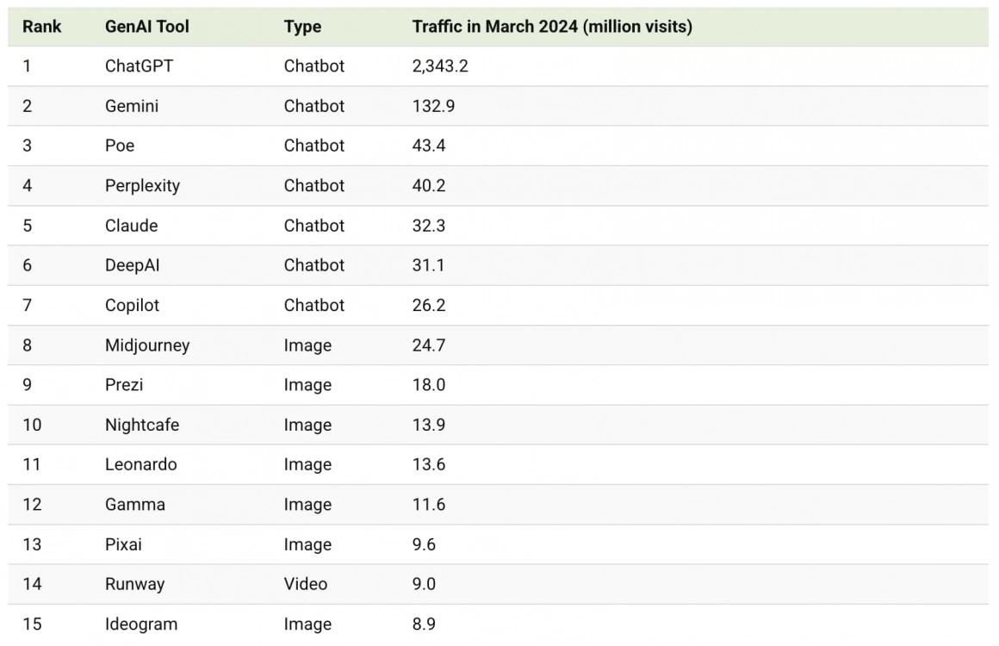

生成式创作工具仍是主流，图片、影音、音乐等创作工具占据大部分席位。

a16z 整理的网页和手机热门 AI 工具提供了更多视角：

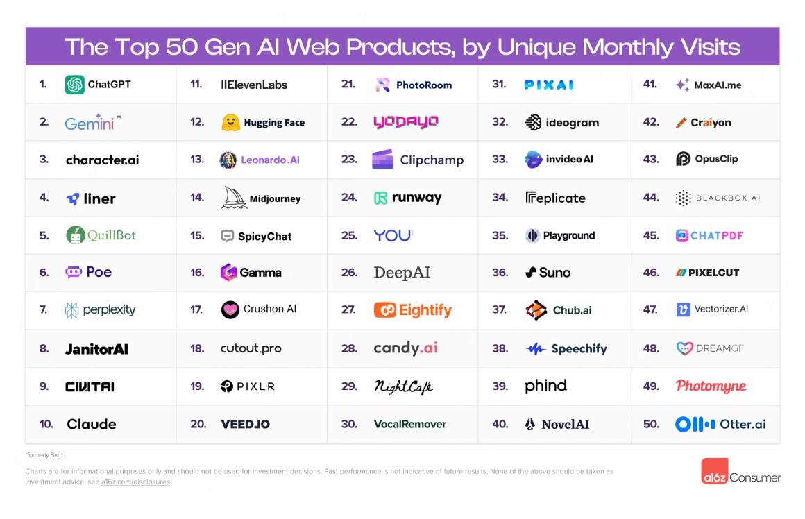

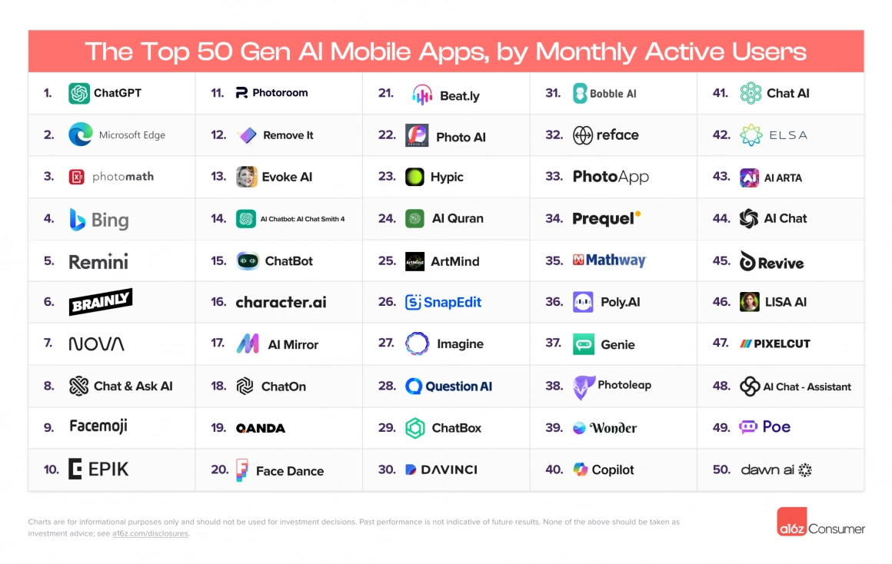

ChatGPT 依然稳坐榜首，每月使用量约 20 多亿，是第二名 Gemini 的 15 倍以上。Character.AI 保持第三名，展现娱乐型 AI 的吸引力。第四名 Liner 是后起之秀，专注写作辅助。第五名 Quillbot 则是英文使用者常用的文法检查工具。

生产力管理工具紧随其后，会议记录、编辑摘要、文案整理等功能有效降低企业运营时间成本。在 APP 领域，除了聊天机器人，照片编辑器和教育学习类 AI 工具也颇受欢迎。

整个 2024 年度全球热门 TOP100 中，约 1/4 来自新创公司，AI 技术让许多独角兽公司崭露头角。

接下来，我们精选了 20 款兼具热门度和实用性的 AI 工具，从文书处理到各式生成工具，帮助你的工作事半功倍。

## 2025 最新 20 款热门生成式 AI 工具推荐

我们将工具分为三大类：「文案生成式 AI 工具」、「图像生成式 AI 工具」、「辅助型 AI 工具」。

## 文案生成式 AI 工具

### ChatGPT：最全能的 AI 对话助手

[立即前往 ChatGPT](http://chatgpt.com/)

ChatGPT 几乎是所有人的 AI 工具首选。只要在对话框输入问题,就能迅速获得如同真人的对答。它的语言模型经过大量数据训练，在创意发想和表达转换方面特别出色。

需要注意的是，ChatGPT 可能偶尔产生不准确信息，使用时需适度查证。付费版本 ChatGPT 4 以前的模型无法即时通过网站检索，只能回答数据库内容。但结合 DALL·E 3 的绘图功能，免费版 ChatGPT 成为功能强大的多元工具，满足文案写作和绘画配图需求。

ChatGPT 可以总结文件、网页资料、撰写程式码、分析图像等，适合处理各种工作流程。

### Gemini：你的 Google 工作好伙伴

[立即前往 Gemini](http://gemini.google.com/)

Gemini 是 Google 开发的聊天机器人，最大优势是完美整合 Google 生态系服务。在 Google Docs 上撰写文章、修改措辞，整理 Google Sheet 数据，在 Google Meet 上记录会议。

台湾的 Google 要使用 Workspace Labs 才能结合 Gemini 的上述功能。想体验 Gemini，可以使用网页版聊天机器人，操作方式与 ChatGPT 相同。

测试发现，Gemini 不会参考其他资料页面，资料较干净但也比较简短，喜欢简洁有力的使用者会喜欢 Gemini 的风格。

### Perplexity：超强搜索，附上引用资料

[立即前往 Perplexity](http://www.perplexity.ai)

需要查找最新、最准确的信息？Perplexity 是你的好帮手。

与 Google 传统搜寻不同，Perplexity 直接整理出完整答案，省去点开多个网页查找的时间。与其他 AI 工具的区别是，Perplexity 不会有 AI 幻觉，每个回答都提供参考来源，可以点进去查找相关信息、比对资料正确性。

Perplexity 还提供多种专业领域的搜寻功能，如学术论文、社群讨论等，让你更精准找到所需信息。回答速度也相当快，比其他需要长时间运算的 AI 工具更有效率。

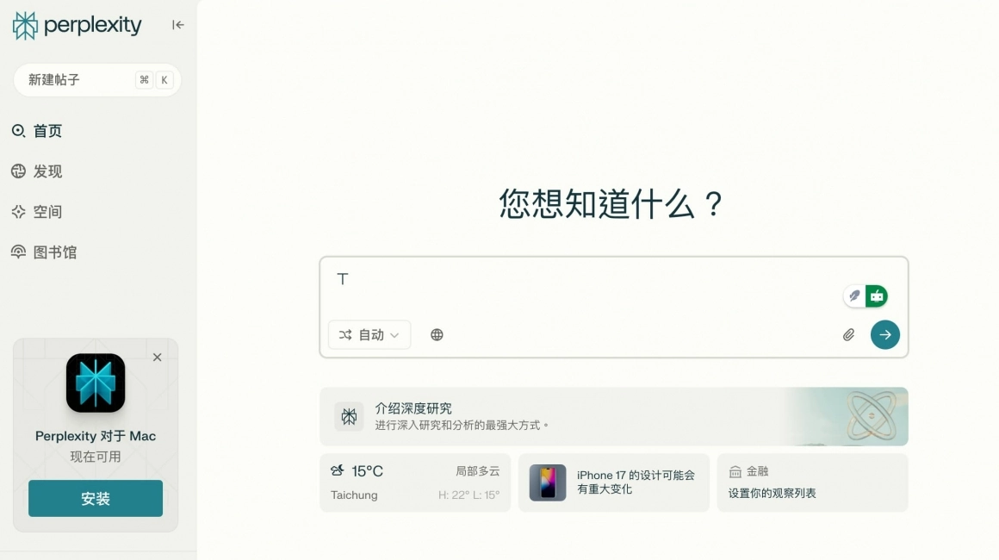

### Grok：X 平台上的智慧对话 AI

[立即前往 Grok](https://grok.com/)

如果你平常有在用 X（前身 Twitter），或许已经注意到 Grok。Grok 由马斯克的 xAI 团队开发，主打「直接整合在 X 平台上」，可以边滑社群、边发问互动。

也可以直接前往页面，像使用 ChatGPT 一样输入对话。

与其他 AI 工具相比，Grok 的风格比较「有个性」。不走制式回答路线，偶尔加入幽默感（或毒舌风格），带点马斯克式的「科技人味道」。用幽默语气在 X 社群上摘要热门讨论、帮你理解趋势内容，甚至针对某条贴文的上下文给你补充说明。

目前在 X 上使用 Grok 需要付费，包含在 X Premium+ 订阅服务里。虽然不像 Perplexity 主打资料引用或学术查找，但在「结合时事、社群脉络」方面，Grok 是目前少数能做得自然又即时的 AI。

近期 Grok 推出号称媲美 ChatGPT-4o 的 Grok3 模型，目前马斯克放话全面免费使用。实际使用体验不错，尤其在数学、科学和写程式方面表现出色。如果你需要👉 [快速获取最新AI聊天工具体验资格，不妨试试Grok Super会员一个月成品号（质保30天）](https://shaoyumi.com/buy/66)，立即感受Grok3的强大能力！

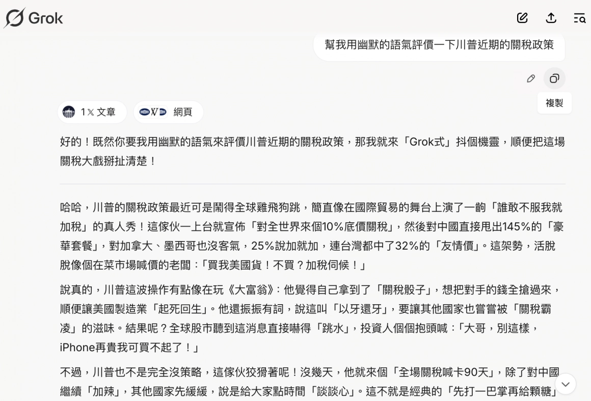

### Claude：自然对话的文案高手

[立即前往 Claude](http://claude.ai/)

Claude 是 Anthropic 开发的生成式 AI 机器人，最大特色是自然的语言处理能力。对话太长也不会陷入 AI 幻觉，不会偏离主题，也不会上下文不连贯，特别擅长理解复杂指令和生成高品质文案。

对话风格非常自然，贴近人类语气，让文章读起来像在和真人交谈。此外，Claude 在翻译方面表现出色，在英文和日文写作能力上也相当优秀。

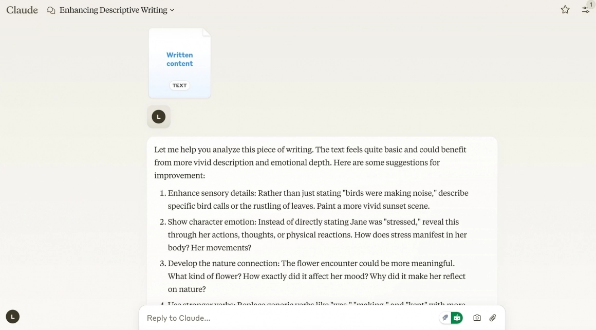

### Liner：模仿你的语气写作

[立即前往 Liner](https://getliner.com/zh)

如果 Claude 擅长自然语言文案写作，那 Liner 就是模仿风格的超强高手。

Liner 可以模仿使用者的写作风格，理解并重现个人语气和表达方式。上传越多文章给 Liner 参考，它生成的文案就会与使用者撰写的文章越相像。这功能对部落客、专栏作家非常方便，是客制化程度最高的 AI 工具，能节省不少工作时间。

要注意，免费版有限制，如每小时只能上传 50 页文件、一天只能问 50 个问题。如果有较多文件处理需求，可以考虑付费升级。

### Felo：整理现有资料的好帮手

[立即前往 Felo](https://felo.ai/)

需要整理大量资料？Felo 能立刻帮助你。它能快速分析和组织各种格式的资料，提取重要信息并浓缩成容易阅读的摘要，或整理表格，甚至制作心智图。

对需要处理大量文件或进行研究的使用者，Felo 可以大大提升工作效率。只要上传文件、网页链接，辅助文字简述，Felo 就能快速产生摘要、关键重点。

Felo 的心智图是一大特色，帮助使用者快速取得重点精华。写论文报告或工作文件都很实用。实际测试发现，列点完整精简扼要，心智图也能帮助快速吸收知识，对学习新事物非常方便！

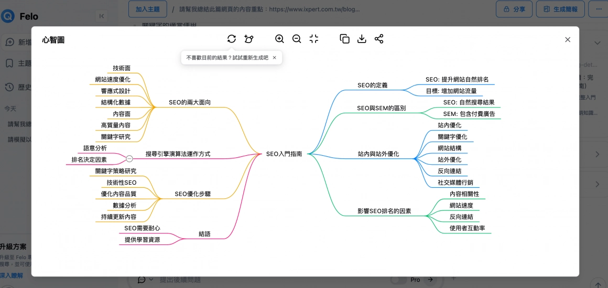

**文案生成式 AI 工具功能比较**

| 工具 | 语言自然度 | 资料整理能力 | 特殊功能 | 适用场景 |
|------|-----------|------------|---------|---------|
| ChatGPT | 语言略带生硬，使用咒语调整可更快取得相对自然的语言 | 可判读资料，但会延伸参考其他资料，同时附上来源 | 生成图像 | 内容创作、研究，需要快速生成文本时 |
| Gemini | 语言略带生硬，咒语调整效果有限 | 只会参考使用者提供的资料 | 可串接 Google 服务 | 使用 Google 相关工具，想要快速取得汇整、文案生成服务时 |
| Perplexity | 语言略带生硬，咒语调整效果有限 | 优异，可找到多项来源资料并附上参考来源 | 无 | 需要有资料来源参考，以便查询资料真实性 |
| Grok | 文案语气精炼但略带生硬，咒语调整效果不错，尤其在幽默语气方面非常出色 | 可根据 X 社群内容提供上下文补充与讨论摘要；聊天室机器人页面可使用 DeepSearch 功能查找更深入资料 | 可整合于 X 平台，能即时回应热门贴文脉络；需订阅 Premium+ 才能使用 | 适合追踪时事热点、社群趋势、在 X 上互动与理解懒人包时使用；DeepSearch 功能也可用来研究数学、科学、写程式等深入资料 |
| Claude | 语气自然，像真人，但无法模仿作者语气口吻 | 无法直接读取网页内容整理，文件整理能力尚可 | 无 | 需要生成语气自然的文案时 |
| Liner | 语气最自然，可模仿使用者语气，但要提供足够文件资料 | 无法整理资料，只能写作文案 | 可自行调整参数，修改模仿语气的力度 | 需要统一文案写作风格，或快速产出多款灵活风格的内容创作时 |
| Felo | 擅长列点分析，语气较生硬 | 资料整理能力优异，尤其擅长将资料转换成表格 | 生成心智图、将对话储存至 Notion | 需要结构化资料和视觉化思考的专业场景时 |

## 辅助型 AI 工具

### NotebookLM：AI 笔记助手

[立即前往 NotebookLM](https://notebooklm.google/)

需要整理大量研究资料、课堂笔记或工作文件？NotebookLM 是你的笔记好帮手！它能根据上传的文件自动生成笔记摘要、重点归纳与概念整理，让你轻松掌握信息重点。

NotebookLM 最大特色是「会读懂你的内容」。只要上传文件、PDF、文章或影片链接，它就能理解内容脉络，并帮你：

- **生成语音摘要**：自动转成口语化的音讯笔记，边听边吸收重点
- **生成影片摘要**：快速整理影片内容章节，节省观看时间
- **生成心智图**：把复杂信息以视觉化方式呈现，清楚看到主题间的关联

对学生、研究人员、内容创作者来说，NotebookLM 不仅能快速整理资料，还能帮你厘清思路、生成有逻辑的重点摘要，是提升学习与研究效率的秘密武器。

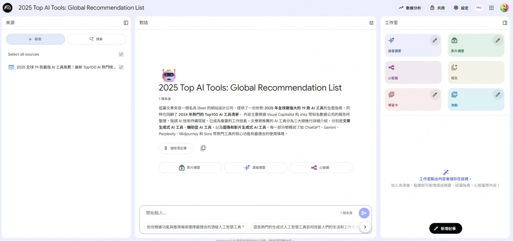

### ChatPDF：聊天式 PDF 助手

[立即前往 ChatPDF](https://www.chatpdf.com/)

有大量 PDF 文件要阅读、整理内容？ChatPDF 是你的最佳助手！

ChatPDF 可以通过聊天方式帮助你快速掌握 PDF 文件内容。只要上传 PDF 档案，它就能立即浏览文件内容，用简单易懂的方式回答你的问题。操作方法像聊天机器人，输入问题后 ChatPDF 会立刻从文件上找到答案回复你。

对学生或研究人员，ChatPDF 非常实用，不用慢慢翻找文件，就能快速找到特定信息。它还会自动提供关键字摘要，帮助你更快理解文章重点。

要注意的是，对一些专业术语或特定领域的文件，ChatPDF 的解释可能不够精确，还需自己进一步确认文件内容。

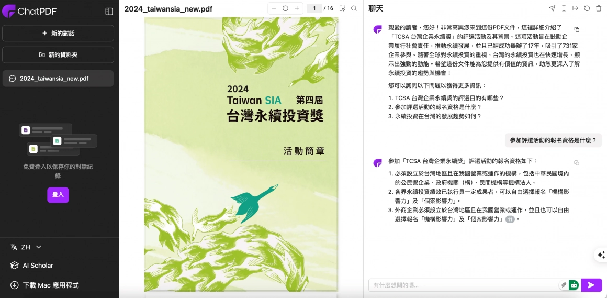

### Otter.ai：即时会议转录

[立即前往 Otter.ai](https://otter.ai/home)

Otter.ai 是强大的语音转文字工具，可以自动参加或邀请机器人加入线上会议，如 Google Meet、Zoom、Microsoft Teams，接着即时转录会议内容。

更棒的是，Otter.ai 还提供互动式聊天功能，让参与者可以在不打断会议流程的情况下，通过文字进行讨论与合作。对需要整理会议记录的团队，这是非常实用的功能。

### Elevenlabs：逼真语音合成

[立即前往 Elevenlab](https://elevenlabs.io/)

Elevenlabs 是专业的 AI 语音生成工具，能将文字转换成自然且富有情感的语音朗读稿。支援超过 29 种语言、120 种不同声音可供选择，让朗读稿有更多元选择。

这工具最特别的是精确调音功能。通过直觉介面，你可以轻松调整声音的清晰度和稳定性，甚至可以加强表现力，创造更生动的语音效果。

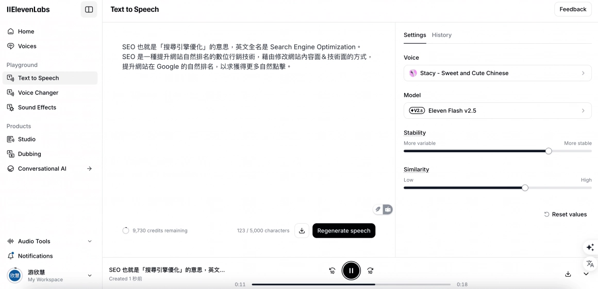

可以听听看免费版本的配音，其实已经有不错的稳定度和流畅度，适合需要创作大量朗读稿的工作者。

值得一提的是，ElevenLabs 特别注重声音使用的合法性和道德问题。它提供多种安全机制，如语音验证和 AI 语音检测工具，确保技术不被滥用。

### Gamma：简报制作救星

[立即前往 Gamma](https://gamma.app/docs)

Gamma 是创新的 AI 简报工具，不需要设计或编码技巧，就能制作出精美的简报、文件和网站。它采用灵活的卡片式设计，取代传统固定投影片，让你更灵活地组织和呈现复杂想法。

Gamma 可以快速生成某个主题的草稿，让使用者自由编辑，接着一键将草稿转换成专业文件。对需要经常制作简报的人，这工具可以大大节省时间和精力，让简报看起来更专业，提升整体呈现效果。

## 图像生成式 AI 工具推荐

### Nano Banana：AI 实现图像自由编辑

[立即前往 Nano Banana](https://aistudio.google.com/prompts/new_chat)

Nano Banana（奈米香蕉）是 Google 最新推出的 AI 图像模型，正式名称为 Gemini 2.5 Flash Image。

它运用先进的 AI 技术，让使用者能通过简单的文字指令，轻松生成与编辑图片，无需复杂的专业软体知识。

Nano Banana 的核心优势在于，能在多轮编辑后保持人物或物件的高度一致性。无论是更换服装、背景，甚至将多张照片融合，都能确保主体的神韵和细节不变。

Nano Banana 支援自然语言指令，意思是对上下文的理解度较高，不用特别思考复杂咒语。任何人都可轻松创作，更适合多种应用场景，包括个人形象设计、电商产品展示和社群媒体内容制作。

下图为产品图融合后的展示效果，可以看见 Nano Banana 的强大 AI 修图功能：

以上为图片修改流程：保留第1张图的背景，换上第2张图的蛋糕，生成结果为第3张图，再将第3张图的背景移至大草原上，生成结果为第4张图，能印证在多轮编辑后依然保持物件的高度一致性。

### Leonardo：快速生成 AI 精美图像

[立即前往 Leonardo AI](https://leonardo.ai/)

Leonardo AI 是强大的 AI 艺术创作平台，能将现实世界的想法转化为令人惊艳的艺术作品。它特别擅长制作游戏方面的图片素材，如角色、物品、场景和概念图。

除此之外，也有模糊变高清、带入商品模板、变更图片细节等多样化功能。平台的操作介面功能直觉，左侧栏可让使用者轻松调整图片数量、尺寸和其他参数。右侧面板还可以输入提示词、选择模型和风格，让整体创作过程更直觉且顺畅。

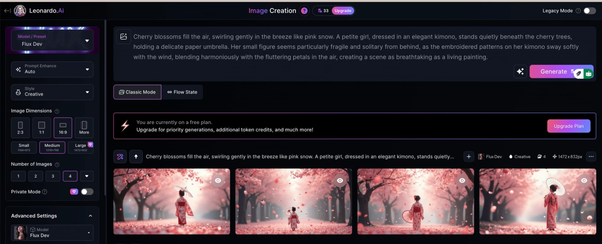

### Midjourney：串接 Discord 的高品质图像生成工具

[立即前往 Midjourney](https://www.midjourney.com/home)

Midjourney 是串接通讯软体 Discord 的图像生成工具，它能根据文字描述生成令人惊艳的图像，也可以上传图片，利用图片生成类似的影像。

这工具最吸引人的地方在于能生成高解析度的图像（最高可达 1,792 x 1,024 像素），并且可以调整各项参数，告诉 AI 你生成图片的要求，让图片有更多细节和空间做更细节的调整。

要注意的是，它需要一定时间学习，才有办法生成更贴近喜好的图片，新手可能需要一些时间来熟悉使用方式！

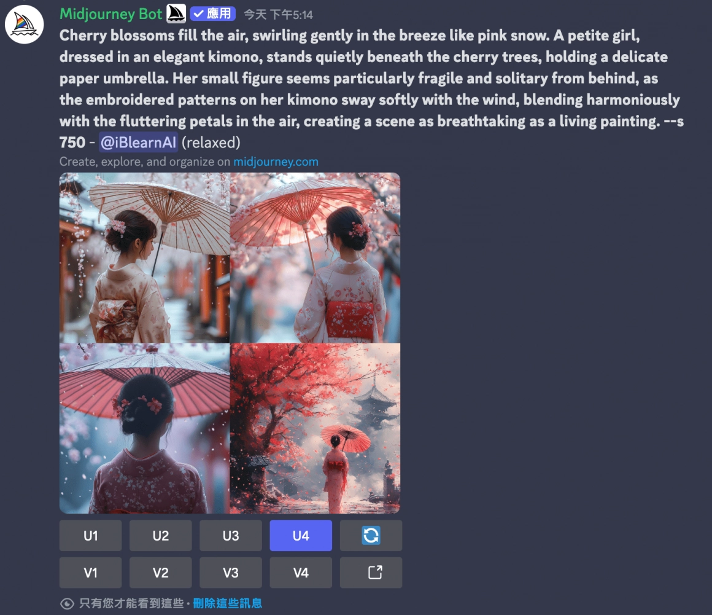

### Cutout.pro：用 AI 快速进行影像处理

[立即前往 Cutout.pro](http://Cutout.pro)

Cutout.pro 是多功能的 AI 视觉设计平台，运用人工智慧和电脑视觉技术，提供一系列影像处理工具。功能包含移除背景、增强照片品质、AI 修复图片、影片去背等许多实用功能。

最棒的是，它提供多种专业解决方案，像室内设计、平面设计、电商等领域都能使用。对需要处理大量图片的使用者，这是非常实用的工具。

## 影片生成式 AI 工具推荐

### Deevid AI：高品质图片转影片 AI

[立即前往 Deevid AI](https://deevid.ai/zh-TW/image-to-video?utm_source=ibest&utm_medium=aff&utm_campaign=bestaitool)

「Deevid AI」是新一代 AI 影片生成平台，提供高速且高品质的影片产出体验，通常不到 1 分钟即可完成。

Deevid AI 主要功能包括：

- **文字转影片**：只需输入文字，AI 即可自动生成场景构图、动画与转场效果
- **图片转影片**：为上传图片添加动态效果，使其栩栩如生
- **影片转影片**：为现有影片套用不同风格与视觉特效，呈现崭新的视觉风格

Deevid AI 也提供多款设计样板，协助用户轻松创作富有情感与创意的影片内容。操作介面直觉易懂，即便是初学者也能快速上手。

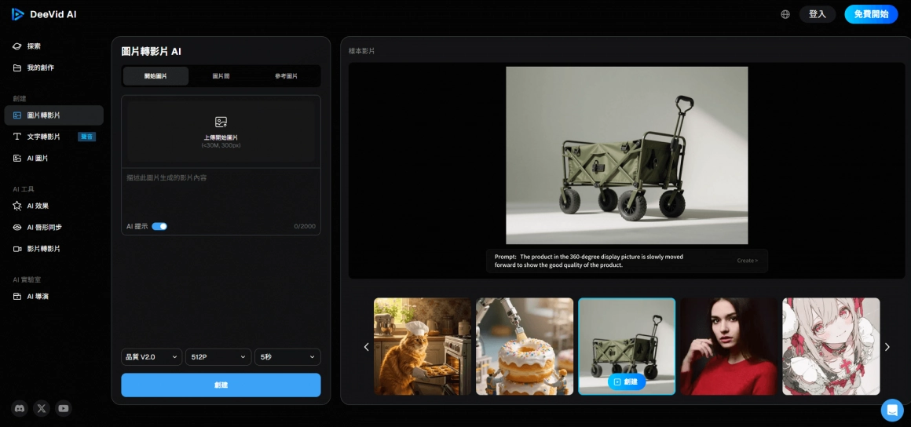

### Google Veo 3：你的电影级影片生成助手

[立即前往 Google Veo3](https://gemini.google.com/)

Google Veo 3 由 Google DeepMind 打造，是顶级 AI 影片生成模型，能将简单的文字或图片想法转化为令人惊艳的影片内容。

Veo 3 能做什么？

- **生成高品质影片**：只需输入简单的文字或图片提示，Veo 3 就能产出高达 8 秒的电影级影片片段
- **同步音讯**：这是 Veo 3 的独家优势。它能生成逼真的音效、背景音乐，甚至是同步对话，让影片更具真实感
- **精准理解指令**：Veo 3 能精准理解复杂指令，确保影片中的动作细节、唇形同步都达到高水准

无论是想快速制作社群媒体短片，还是为专案打造专业级影片，Veo 3 都能大幅提升创作效率，让想法不再只是空想。

### Sora 2：快速生成高品质 AI 影片

[立即前往 Sora 2](https://openai.com/zh-Hant/sora/)

Sora 2 是 OpenAI 推出的全新 AI 影片生成模型，能从文字、图片或短片生成逼真的动态影像。

新版在画面真实度、物理准确性与声音同步上全面升级，影片内容不仅更自然，也能自动搭配对话与音效。使用者可透过 ChatGPT Plus 或 Pro 方案体验 Sora 2，生成最高 1080p、长约 20 秒的影片。

Sora 2 目前整合于 ChatGPT 与 Sora App 中，开放部分地区使用，为创作者提供更直觉且高品质的影片制作方式。

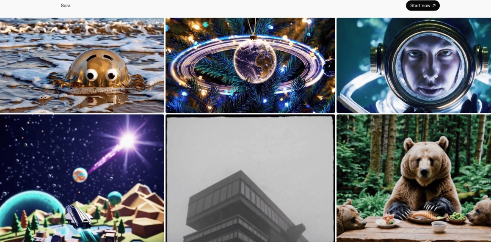

### Invideo：AI 帮助你快速生成影片＋轻松剪辑

[立即前往 Invideo](https://invideo.io/?gad_source=1)

Invideo 是强大的
